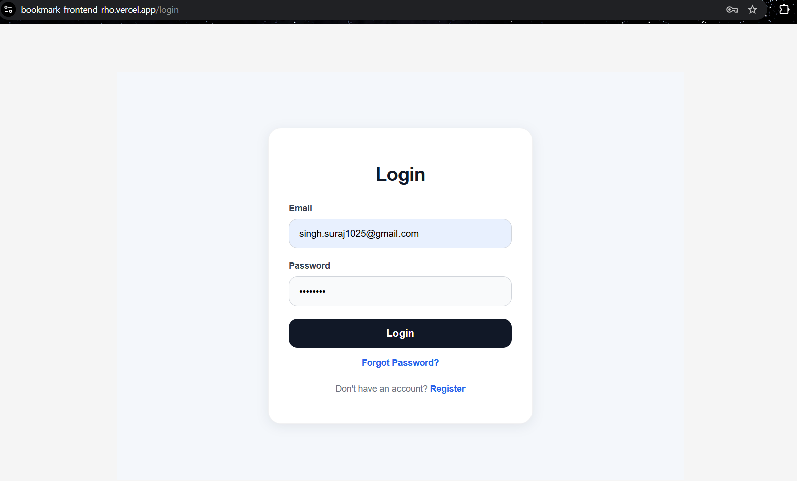
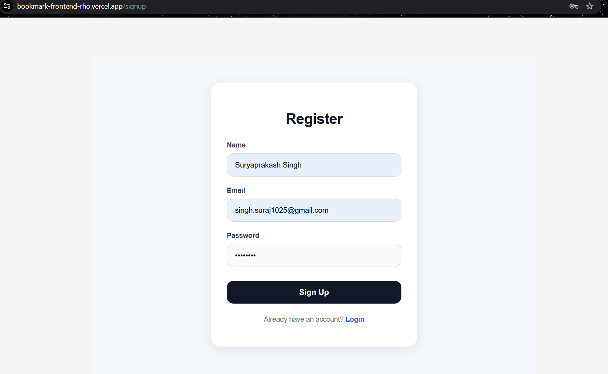
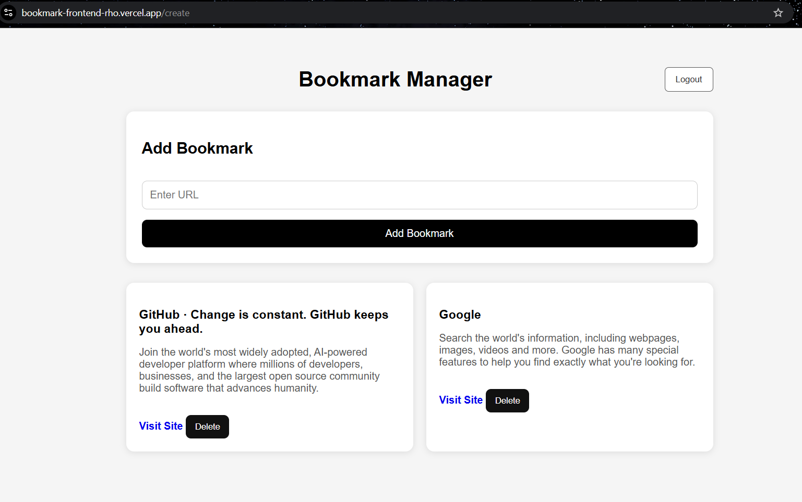
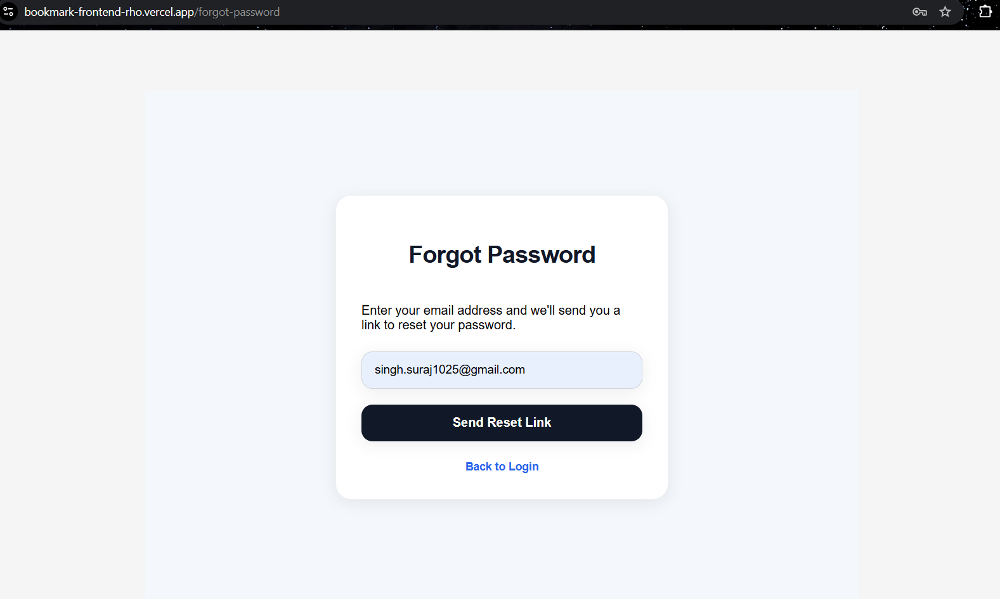
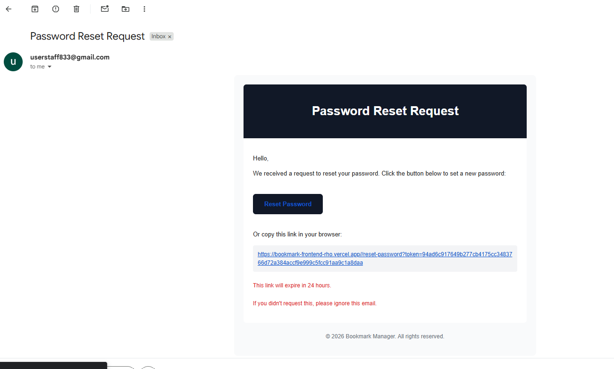

# 🔖 Bookmark Manager

A production-style full-stack bookmark management application built with **Go, Angular, gRPC, PostgreSQL, JWT Authentication, and Docker**. The project demonstrates secure authentication, distributed system design, and communication between REST and gRPC services.

---

## 🌐 Live Demo

* https://bookmark-frontend-rho.vercel.app/
> **Note:** Password reset functionality is fully implemented. The live deployment uses Render's free tier, which restricts outbound SMTP connections, so password reset emails are unavailable in the hosted demo. The feature works correctly in local development.

---

## 🧠 Overview

Bookmark Manager is a production-style distributed application that allows users to securely save and manage bookmarks through an intuitive interface.

The application follows a microservices architecture where a REST API communicates with a dedicated gRPC service for bookmark preview generation.

### Features
* User Registration
* Secure Login
* JWT Authentication & Authorization
* Password Reset (Email-based)
* Create Bookmarks
* View Bookmarks
* Delete Bookmarks
* Automatic Bookmark Preview Generation
* Protected Routes
* Responsive UI
* Automatic Database Connection Retry

---

## 🏗️ Architecture

```text
                Angular Frontend (Vercel)
                          │
                          ▼
                  JWT Authentication
                          │
                          ▼
                  Go REST API (Render)
                    │            │
                    ▼            ▼
              gRPC Preview    PostgreSQL
                 Service      (Supabase)

```

---

## ⚙️ Tech Stack

### Backend

* Go
* Gin
* JWT Authentication
* gRPC
* PostgreSQL (Supabase)
* Docker

### Frontend

* Angular
* Responsive UI (Card-based layout)
* Route Guards

### Infrastructure

* Render 
* Vercel
* Supabase

---

## 🔑 Key Features

### Authentication
* User Signup
* User Login
* JWT-based Authorization
* Password Hashing using bcrypt
* Password Reset via Email
* Protected API Endpoints
  
### Bookmark Management
* Create Bookmark
* Fetch User Bookmarks
* Delete Bookmark
* Preview Metadata through gRPC Service

### Backend Design
* REST API separated from Preview Service
* Internal communication using gRPC
* Stateless Authentication using JWT
* Database Retry Mechanism
* Clean layered architecture (Handlers → Services → Repository)

---

## 🧩 System Design Highlights

* Distributed microservices architecture
* Separation of concerns
* Secure authentication flow
* Internal service communication using gRPC
* Stateless backend
* Scalable backend design
* Production deployment across multiple cloud providers

---

## 📸 Screenshots

<h3>Login</h3>



<h3>Register</h3>



<h3>Dashboard</h3>



<h3>Forgot Password</h3>



<h3>Reset Password</h3>



---

## 🛠️ Local Setup

### 1. Clone the repository

```bash
git clone https://github.com/your-username/bookmark-manager.git
cd bookmark-manager
```

---

### 2. Backend Setup

```bash
cd api
go mod tidy
go run main.go
```

---

### 3. gRPC Service

```bash
cd preview-service
go run main.go
```

---

### 4. Frontend Setup

```bash
cd frontend
npm install
ng serve
```

---

## 🧪 API Endpoints

### Authentication
| Method | Endpoint         | Description               |
| ------ | ---------------- | ------------------------- |
| POST   | /signup          | Register new user         |
| POST   | /login           | Authenticate user         |
| POST	 | /forgot-password | Send Password Reset Email |
| POST	 | /reset-password  | Reset Password            |

### Bookmarks
| Method | Endpoint       | Description     |
| ------ | -------------- | --------------- |
| GET    | /bookmarks     | Fetch bookmarks |
| POST   | /bookmarks     | Create bookmark |
| DELETE | /bookmarks/:id | Delete bookmark |

---


## 🚀 Future Improvements

* Bookmark Categories
* Search & Filtering
* Pagination
* Edit Bookmarks

---

## 💡 What I Learned

This project helped me gain hands-on experience with:

* Designing distributed backend systems
* Building REST APIs in Go
* Developing gRPC services
* JWT Authentication & Authorization
* Password Hashing with bcrypt
* Secure Password Reset Flow
* PostgreSQL integration
* Route Guards
* Docker-based development
* Deploying applications across Render, Vercel, and Supabase
* Handling CORS, networking, and production deployment challenges

---

## 📬 Contact

* LinkedIn: https://www.linkedin.com/in/suryaprakash-singh/
* Email: [singh.suraj1025@gmail.com](mailto:singh.suraj1025@gmail.com)

---

⭐ If you found this project interesting, consider giving the repository a star.
